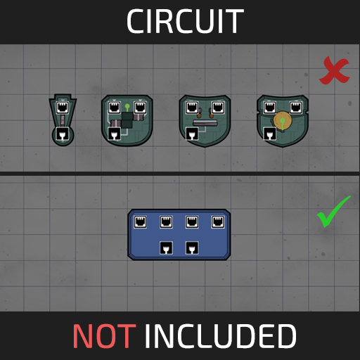

# Circuit Not Included

Circuit Not Included replaces the clutter of vanilla logic gates 
with programmable circuit.

Inspired by Logisim, this mod allows you to consolidate multiple inputs and outputs into a single building, 
controlled by custom logical expressions.